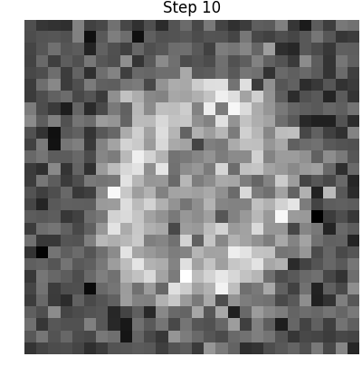

# Autoencoder Reconstruction Visualizer

Visualizes the gradual process where autoencoder encodes and decodes images
using MNIST hand-written digit dataset as an example.

## Dependencies

- TensorFlow
  - Tested with TF 1.7, however, `tf.contrib.learn.datasets` is deprecated
    and will be removed in a future version
  - Not included in `requirements.txt` because there are multiple versions
    available (cpu and gpu), install manually
- Numpy
- Matplotlib
- Imagemagick (used for creating gif from individual images)

## Installation

You can install dependencies with `make init`, which uses pip to install
Numpy and Matplotlib. Virtualenv is always recommended.

## Usage

You can run the script with `python autoencoder_visualizer.py`. Alternatively,
`make run` does the same thing. This saves the images into figures folder
(from different steps of reconstruction).

When you want to combine images into a gif, just run `make gif`.

## Example output gif

Here is an example gif generated by the script visualizing the first 200
iterations of autoencoder reconstructing one single image from the MNIST datset.

